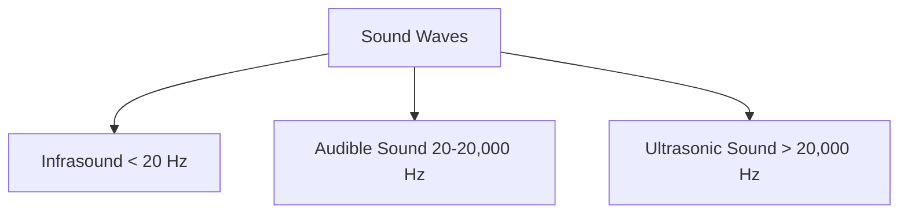

# Infrasound Monitoring for Structural Health in Skyscrapers

As skyscrapers continue to reach greater heights, there’s an increasing demand for innovative solutions to ensure their structural integrity. In recent years, infrasound technology has emerged as a cutting-edge method for monitoring the structural health of these engineering marvels.

## Understanding Infrasound

Infrasound represents acoustic waves with frequencies below the human audible range, typically below 20 Hz. While these sounds are inaudible to our ears, they carry valuable information about a building's health and safety. 

Infrasound technology captures and analyzes these low-frequency sounds to detect anomalies in a structure's behavior.

## How Does Infrasound Monitoring Work?

Infrasound monitoring involves the following steps:

1. **Data Collection:** Install infrasound sensors on various strategic points in the skyscraper. These sensors capture, amplify, and digitally record the ultra low-frequency sound waves (infrasound) emanating from the structure.

2. **Data Analysis:** Advanced algorithmic models analyze the time-frequency representations of the collected data, bringing out the patterns and anomalies.

3. **Anomaly Detection:** Any significant deviation from the standard behavior signals an issue with the structural integrity of the building.

## Benefits of Infrasound Monitoring

| Benefits | Description |
|----------|-------------|
| Early Detection | Infrasound monitoring can identify structural issues even before they manifest visibly. This can help prevent catastrophic failures. |
| Comprehensive Coverage | As infrasound waves can travel long distances without significant attenuation, they can provide detailed information about a building's health across large areas. |
| Cost-Effective | Compared with traditional structural health monitoring techniques (like visual inspection or using dynamic response sensors), infrasound monitoring can be more cost-effective over the long term, particularly for tall skyscrapers. |

## Challenges in Implementation

Despite the many benefits, some challenges persist in the application of infrasound monitoring technology:

- High initial investment: Installing a network of infrasound sensors is capital-intensive.

- Noise interference: Urban settings are filled with extensive low-frequency noise, which can interfere with the accuracy of infrasound detection.

- Need for expert analysis: Extracting meaningful information from infrasound data requires expertise in acoustic signal processing and structural engineering.

## Conclusion

In conclusion, infrasound monitoring offers a promising path to proactive structural health management in skyscrapers. This technology, despite its challenges, holds the potential to revolutionize how we approach the longevity and safety of our towering structures. As we continue to push the envelope in skyscraper construction, such innovations will play a crucial role in ensuring these buildings are not just taller, but also safer and more sustainable.