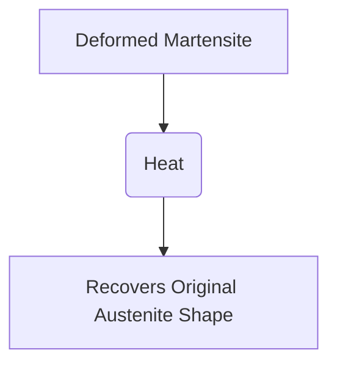

# Shape Memory Alloys in Adaptive and Resilient Building Systems

## Introduction

Shape Memory Alloys (SMAs) represent a revolutionary material technology in the construction industry. The unique characteristic of these materials, referred to as memory effect, allows them to return to their original shape after undergoing deformation when subjected to certain stimuli e.g., heat.

In this article, well dive into the intriguing world of SMAs, explore their applications in adaptive and resilient building systems, and share a step-by-step guide on integrating SMAs into your construction project.

## Basics of Shape Memory Alloys

SMAs are metallic materials that demonstrate the ability to return to their original shape after being deformed. This unique property is termed as the 'memory effect'. The two types of shape memory effect are One-Way Shape Memory and Two-Way Shape Memory.

### One-Way Shape Memory

This describes the phenomenon where an SMA deformation in the low-temperature phase (martensite) reverts back to its parent shape upon heating (austenite).



### Two-Way Shape Memory

This refers to an effect where the SMA remembers two different shapes - one at high temperature and another at low temperature, transforming reversibly between them.

```mermaid
graph TB
A[Austenite Shape (High Temperature)] --> |Cooling| B[Martensite Shape (Low Temperature)]
B --> |Heating| A
```

## Applications in Building Systems

SMAs offer significant benefits in construction, especially in adaptive and resilient building systems. Some practical uses include:

1. **Seismic Energy Dissipation:** SMAs make buildings more resilient to seismic activities by absorbing and dissipating earthquake energy.
2. **Controlled Solar Shading:** SMA components can dynamically adapt to solar radiation, providing efficient shading and reducing the building's energy footprint.
3. **Structural Actuation and Control:** By leveraging the two-way shape memory effect, structures can self-adjust, minimizing the need for robust mechanical control mechanisms.

## Tutorial: Integrating SMAs into Building Systems

Here's a step-by-step guide on how you can integrate SMAs into your building systems:

1. **Identify the Application:** Determine where you want to use SMAs in your building system. The choice of application will often depend on the system's needs. Is it seismic mitigation, shading control, or structural actuation?
2. **Choose the Appropriate SMA Type:** Choose the SMA that suits the identified application; it can be Nickel titanium (NiTi‎‎), Copper-Aluminium-Nickel (CuAlNi), or any other suitable alloy.
3. **Design the SMA Element:** This includes choosing the shape and size of the SMA element, and designing it for the transformation temperatures to suit the environmental conditions of the site.
4. **Install the SMA Element:** This involves incorporating the SMA element into the structural or architectural component of the building system. Ensure proper installation to maintain structural integrity and functionality.
5. **Testing and Commissioning:** Following the installation, perform testing to ensure the SMA component works correctly. Check for its shape memory behaviour and verify it serves the intended function.

## Challenges and Solutions

While SMAs hold immense potential, they also pose certain challenges. For instance, cyclic performance of SMAs can lead to uncontrolled shape changes. This can be mitigated by smart control technologies to monitor and adjust the applied stimulus.

Design complexity is another challenge due to the non-linear behaviour of SMAs. Engineers can overcome this by utilizing advanced design software tools for accurate modelling and simulation.

Despite these challenges, the promising potential of SMAs offers a path to significantly enhance the adaptive and resilience capabilities of modern building systems. The focus falls now on construction professionals to embrace this advanced material and explore its vast possibilities in their architectural designs.

## Conclusion

SMAs, with their ability to recover deformation, present a promising avenue for the development of adaptive and resilient building systems. As construction professionals, it is our role to effectively harness this cutting-edge technology, further advancing our capabilities to build structures that are not only beautiful but highly adaptable and resilient.