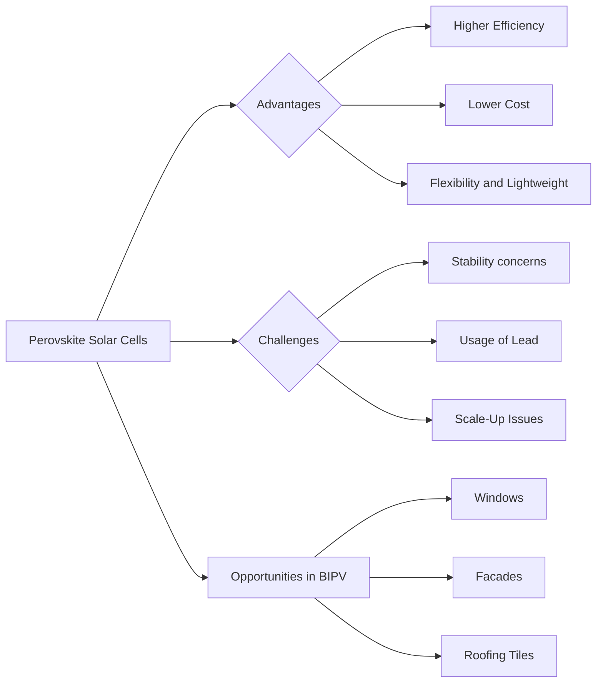

# Perovskite Solar Cells: Next-Generation Building-Integrated Photovoltaics

Solar energy technology continually seeks to improve efficiencies while bringing down costs. A new breed of solar cells – Perovskite Solar Cells (PSCs) – has entered the stage with the promise to revolutionize the photovoltaic industry and potentially redefine construction processes. 

## Introduction to Perovskite Solar Cells

PSCs are crafted from perovskite-structured compounds, usually a hybrid organic-inorganic lead or a tin-based material. They've quickly earned their place in the field due to their exceptional light absorption, charge-carrier mobilities, and lifetimes.

## Advantages of Perovskite Solar Cells

Here are a few key advantages that make PSCs the technology to watch:

1. **Efficiency**: With efficiencies so far reaching up to 25.2% in lab conditions, they rival the highest efficiencies of traditional silicon solar cells.
2. **Cost**: PSCs are potentially more cost-effective due to the lower manufacturing costs compared to silicon PV cells.
3. **Flexibility and Lightweight**: PSCs can be made using techniques that yield flexible and lightweight panels. This opens the door to new applications, especially in BIPV.

## PSCs in Building-Integrated Photovoltaics (BIPV)

Building-integrated photovoltaics (BIPV) return dual benefits of replacing conventional building materials and generating power at the same time. PSCs are potentially poised to push BIPV into the mainstream due to their efficiency, cost-effectiveness, and versatility. Key applications include integration in windows, facades, and even roofing tiles.

## Challenges 

Despite the potential advantages, there are some notable challenges with PSCs:

1. **Stability**: PSCs currently suffer from shorter lifetimes due to degradation when exposed to moisture, heat and UV radiation.
2. **Lead**: Most PSCs contain lead, which is harmful if released into the environment.
3. **Scale-Up**: Successful scale-up, while maintaining high efficiency and long lifespan, is yet to be proven.

## The Future of PSCs in Construction

Though PSCs are still progressing through the technology readiness pipeline, they already present promising prospects for construction once the challenges are overcome. With their unique attributes, PSCs could play a vital role in the development of zero-energy buildings and bring about innovations in architectural design.

The advent of PSCs shows promise for a more sustainable future, potentially transforming the face of building designs while making solar adoption more cost-effective and widespread. Their development and eventual deployment will certainly be an exciting space to watch in the energy and construction fields.

---

**References**
1. National Renewable Energy Laboratory (NREL). (2020). Best Research-Cell Efficiency Chart.
2. Snaith HJ. (2013). Perovskites: The Emergence of a New Era for Low-Cost, High-Efficiency Solar Cells.
3. Ono LK, Qi Y. (2018). Research Progress on Organic-Inorganic Hybrid Perovskites and their Applications in Optoelectronic Devices. 

---