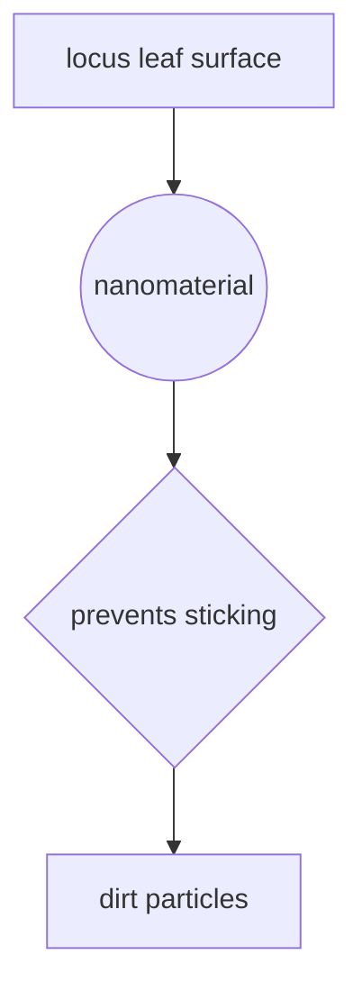

---

title: 'Revolutionizing Construction with Self-Cleaning Nanomaterials for Low-Maintenance Buildings'
date: '2024-07-15'
tags: ['Nanotechnology', 'Construction', 'Low-maintenance', 'Self-cleaning', 'Nanomaterials']
draft: true
summary: 'Discover the emerging applications of self-cleaning nanomaterials in the construction industry, their benefits, as well as considerations for future developments.'

---

# Revolutionizing Construction with Self-Cleaning Nanomaterials for Low-Maintenance Buildings

With the advent of nanotechnology and its rapid integration into various industries, one field that is undergoing a major transformation is construction. The introduction of **self-cleaning nanomaterials** could potentially change the face of construction by vastly reducing the maintenance required for buildings.

## Understanding Self-Cleaning Nanomaterials

At a molecular scale, nanotechnology manipulates and controls individual atoms and molecules. Self-cleaning nanomaterials leverage these properties to clean themselves in a variety of ways. Some of these nanomaterials imitate natural phenomena, like 'the lotus effect', where nano-structures on lotus leaves prevent dirt particles from adhering to the surface.


This property, replicated by nanotech scientists and material engineers, now applied in creating nanomaterials with similar 'dirt-repellant' properties. 

## Application in Construction

Self-cleaning nanomaterials in construction mainly finds application in two aspects:

1. **Exterior Finishing**: Various nanomaterials such as nano-TiO2, nano-SiO2, and nano-ZnO are used as additives in paints and coatings for external surfaces. These materials break down organic substances like algae, fungi, and dirt, maintaining a clean surface.

2. **Window Cleaning**: Self-cleaning glass, developed using nanotechnology, uses photocatalytic and hydrophilic properties to keep windows free from dirt and other particles.

These advancements can significantly reduce the upkeep costs and increase the overall lifespan of buildings.

## Benefits of Self-Cleaning Nanomaterials

| Benefits               | Description                                                                 |
|----------------------- |---------------------------------------------------------------------------|
| Cost-effective        | Reduced maintenance costs for building structures.                         |
| Time-saving           | Frequent surface cleaning needs are eliminated.                            |
| Environmental Friendly| No detergents or harsh chemicals required for cleaning, reducing pollution.|
| Increased Lifespan    | Nanocoatings help protect against harmful UV rays, increasing lifespan.    |

Self-cleaning nanomaterials also have potential health benefits by reducing the risk of allergenic pathogen growth, contributing to healthier indoor and outdoor environments.

## Future Considerations

As promising as self-cleaning nanomaterials are, several considerations should be addressed:

- More research into the long-term effects on human health and the environment.
- Regulatory bodies must establish clear guidelines regarding nanomaterial application.
- The process of manufacturing nanomaterials must be made more cost-effective.

```python
# An algorithmic approach to address some of these future considerations
class Nanomaterial:
  def __init__(self, type):
    self.type = type

  def research_impact(self):
    # Research into health and environmental impact
    pass

  def manufacturing_cost(self):
    # Analyze manufacturing cost and methods for reducing it
    pass

  def regulatory_guidelines(self):
    # Establish clear regulatory guidelines
    pass
```

There's no doubt that self-cleaning nanomaterials have immense potential in turning the construction industry towards low-maintenance, and more environmentally friendly practices. With responsible application, this emerging technology is likely to become a standard in construction of the future.

---
```
